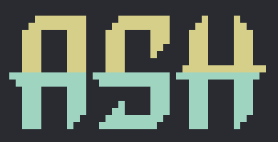
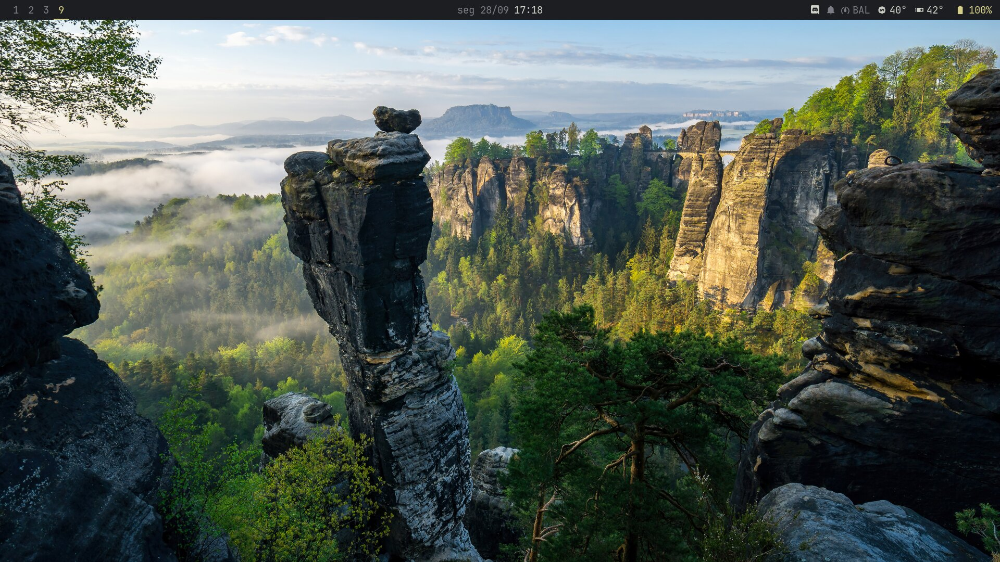
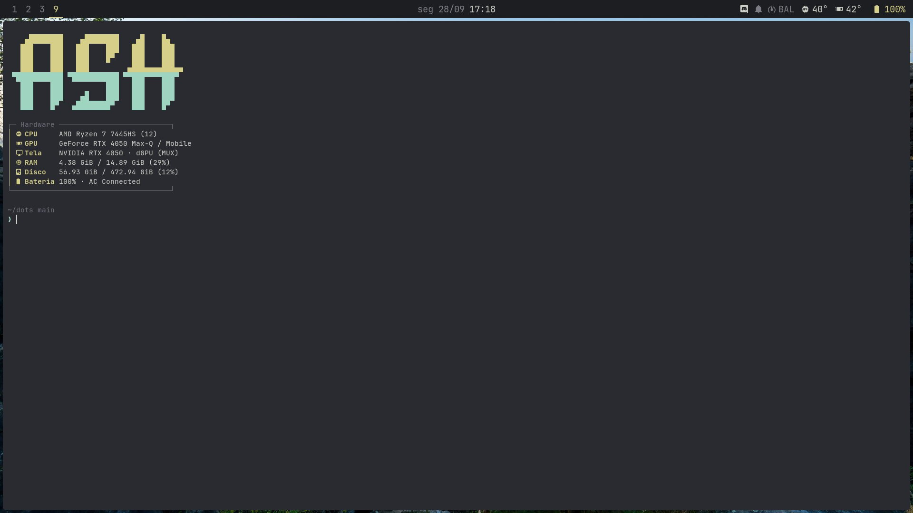
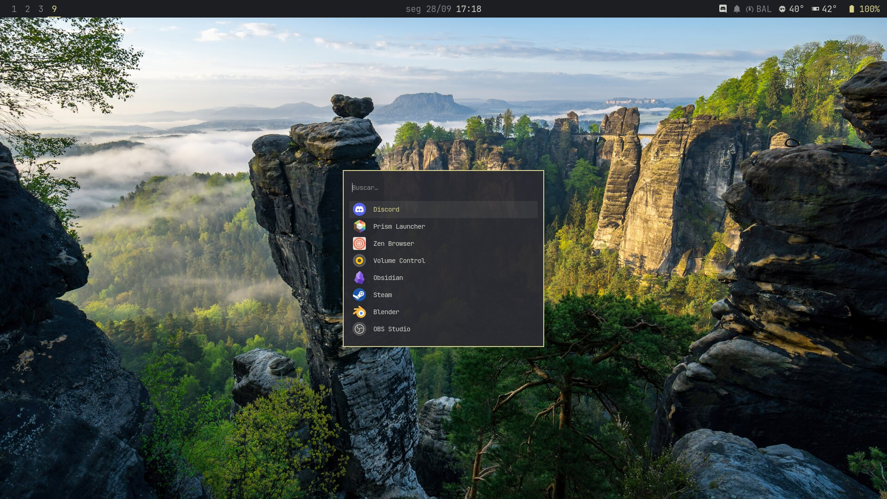
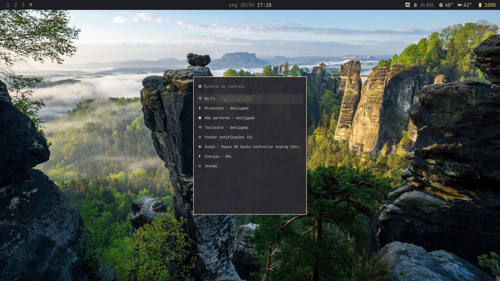
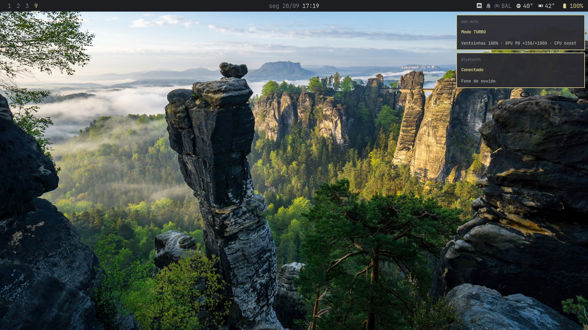
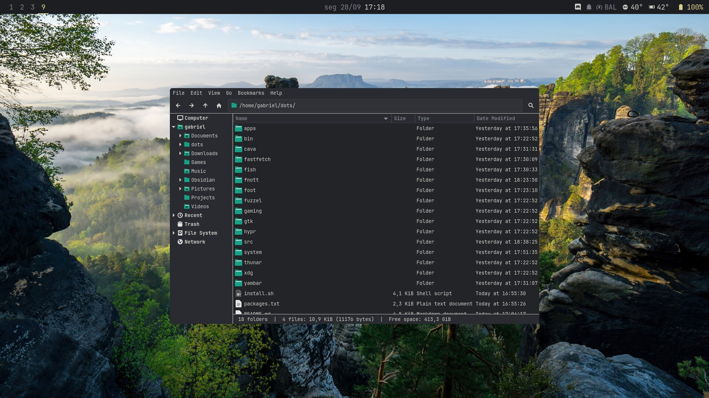

<div align="center">



# ash-dots

**A Hyprland setup built for speed.** No blur, no shadows, no animations, no display manager —
just a tiling desktop that gets out of the way and hands every frame to your games.

[](https://cachyos.org)
[](https://hyprland.org)
[](https://wayland.freedesktop.org)
[](src)


</div>

---

## Why "ash"

Most rices spend the GPU on glass, blur and springy animations. **ash** spends it on you:

| | |
|---|---|
| ⚡ **Instant** | Blur, shadows and animations off. Windows appear the frame they're created. |
| 🎮 **Low latency** | Tearing (`immediate`) + direct scanout for fullscreen games, VRR only in fullscreen, 1-frame GL queue. |
| 🪶 **Tiny** | No display manager (TTY1 → Hyprland), `yambar` instead of a Qt/GTK bar, tray and GPU tools written in C. |
| 🔥 **TURBO mode** | One click on the bar: fans 100%, GPU locked to P0 + overclock, CPU boost, max PPT. |
| 🎨 **One palette** | Terminal, bar, launcher, notifications, GTK and folder icons all share the *ash* colors. |

---

## Gallery

<table>
  <tr>
    <td width="50%"><p align="center"><b>Desktop</b> — yambar: workspaces · date · tray · power profile · temps · battery</p></td>
    <td width="50%"><p align="center"><b>Terminal</b> — foot + fish, ASH logo and a hardware box in fastfetch</p></td>
  </tr>
  <tr>
    <td><p align="center"><b>Launcher</b> — fuzzel, Omarchy-style (<kbd>Super</kbd>+<kbd>Space</kbd>)</p></td>
    <td><p align="center"><b>Control center</b> — Wi-Fi, Bluetooth, DND, audio, power, session (<kbd>Super</kbd>+<kbd>C</kbd>)</p></td>
  </tr>
  <tr>
    <td><p align="center"><b>Notifications</b> — fnott in the ash palette, bell on the bar = do not disturb</p></td>
    <td><p align="center"><b>Wallpapers</b> — swaybg + fuzzel picker (<kbd>Super</kbd>+<kbd>Shift</kbd>+<kbd>W</kbd>)</p></td>
  </tr>
  <tr>
    <td colspan="2"><p align="center"><b>Files</b> — Thunar with the ash GTK theme and teal Papirus folders</p></td>
  </tr>
</table>

---

## What's inside

Every folder is a [GNU stow](https://www.gnu.org/software/stow/) package that mirrors `$HOME`.

| Package | What it does |
|---|---|
| `hypr` | Hyprland in **Lua**, split into `env` · `monitors` · `input` · `look` · `rules` · `binds` · `autostart` |
| `yambar` | Bar template scaled to the monitor by `bar`: workspaces, clock, tray, power profile, CPU/GPU temps, battery |
| `foot` · `fish` | Terminal + two-line prompt (`~/path branch` / `❯`), fastfetch on open |
| `fastfetch` | Figlet **ASH** logo + hardware box |
| `fuzzel` | Launcher, and the UI for every menu (control center, tray menus, wallpapers) |
| `fnott` | Notifications; <kbd>Super</kbd>+<kbd>N</kbd> clears them all |
| `cava` | Audio visualizer (<kbd>Super</kbd>+<kbd>Shift</kbd>+<kbd>V</kbd>) |
| `gaming` | gamemode (switches to TURBO while a game runs) + MangoHud (<kbd>Shift</kbd>+<kbd>F12</kbd>) |
| `gtk` · `thunar` | "ash" `gtk.css` over Adwaita-dark, bookmarks and right-click actions |
| `apps` | Hides useless `.desktop` entries from the launcher |
| `bin` | `screenshot`, `wallpaper`, `control-center`, `powerprofile`, `notif`, `papirus-ash`, `bar`, tray helpers |
| `src` | C tools: `ash-tray` (StatusNotifier tray via sd-bus), `nvoc` (NVML overclock), `mouse-hz` (polling-rate meter) |
| `system` | `/etc` files: scx scheduler, sysctl, udev, NetworkManager, `ash-turbo` service (copied, not linked) |

---

## Performance

**Desktop**
- 144 Hz, hardware cursor, VRR in fullscreen only (no desktop flicker)
- `allow_tearing` + `immediate` rule for Steam/Proton/gamescope/native games, direct scanout
- `__GL_MaxFramesAllowed=1` — at most one queued frame in OpenGL
- Raw mouse (no acceleration), keyboard repeat 250 ms / 50 Hz
- Hyprland pinned to the NVIDIA GPU → the AMD Mesa/LLVM stack never loads (~20–40 MB saved)
- Native Wayland apps everywhere, so XWayland sits idle

**System**
- `scx_lavd` sched-ext scheduler from boot (gaming mode under TURBO)
- NVMe on the `none` I/O scheduler
- TCP **BBR** + `fq`, 16 MB buffers, no slow-start after idle, MTU probing
- Wi-Fi power saving off; RTL8852BE (rtw89) without ASPM

**TURBO** (click `BAL` on the bar, or launch any game through gamemode)

```
fans 100%  ·  GPU P0 ≥1800 MHz, +150 core / +1000 mem  ·  CPU performance + boost
PPT 80 W  ·  Dynamic Boost 25 W  ·  thermal target 87 °C  ·  scx_lavd gaming
```

`ash-turbo status` shows everything. Right-click the profile for **SILENT**.

> Tuned on an ASUS TUF A16 (Ryzen 7 7445HS + RTX 4050). The TURBO fan curve and power limits are
> specific to that laptop — check `system/usr/local/bin/ash-turbo` before enabling it on other hardware.

---

## Keybinds

| Keys | Action |
|---|---|
| <kbd>Super</kbd>+<kbd>Enter</kbd> / <kbd>T</kbd> | Terminal / floating terminal |
| <kbd>Super</kbd>+<kbd>Space</kbd> | Launcher |
| <kbd>Super</kbd>+<kbd>W</kbd> / <kbd>E</kbd> | Browser / files |
| <kbd>Super</kbd>+<kbd>C</kbd> | Control center |
| <kbd>Super</kbd>+<kbd>Q</kbd> / <kbd>F</kbd> / <kbd>Shift</kbd>+<kbd>F</kbd> | Close / float / fullscreen |
| <kbd>Super</kbd>+<kbd>H</kbd><kbd>J</kbd><kbd>K</kbd><kbd>L</kbd> | Focus (add <kbd>Shift</kbd> to move) |
| <kbd>Super</kbd>+<kbd>1…0</kbd> | Workspace (add <kbd>Shift</kbd> to send the window under the cursor) |
| <kbd>Super</kbd>+<kbd>Shift</kbd>+<kbd>S</kbd> / <kbd>Print</kbd> | Screenshot region / full (saved + copied) |
| <kbd>Super</kbd>+<kbd>Shift</kbd>+<kbd>W</kbd> / <kbd>Alt</kbd>+<kbd>W</kbd> | Pick / next wallpaper |
| <kbd>Super</kbd>+<kbd>N</kbd> | Dismiss notifications |
| <kbd>Super</kbd>+<kbd>Shift</kbd>+<kbd>R</kbd> | Reload Hyprland |

---

## Install

On a fresh **CachyOS** (or Arch) install:

```sh
git clone https://github.com/gabesvr/ash-dots ~/dots
~/dots/install.sh
```

The script installs `packages.txt`, builds yambar (AUR) and the C tools, stows every package,
copies the `/etc` files, enables the services and applies the GTK/icon theme. Log out, log in on **TTY1**
and Hyprland starts on its own.

**Steam:** compatibility tool `proton-cachyos-slr`, launch options `gamemoderun MANGOHUD=1 %command%`.

> The configs are commented in Portuguese — the code reads the same in any language.

---

## Palette


Font: **JetBrainsMono Nerd Font** · logo: figlet *Delta Corps Priest 1*

<div align="center">
<br>
<sub>made on CachyOS by <a href="https://github.com/gabesvr">gabesvr</a></sub>
</div>
